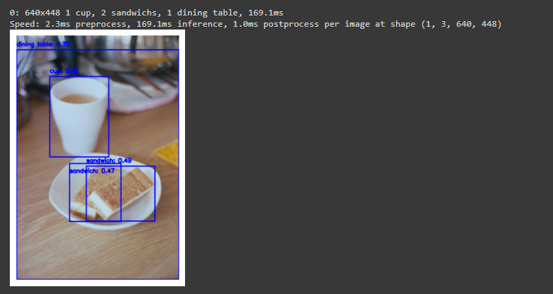

# ObjectClassification
## Summary:

Finetuning ResNet50 and yoloV8 to classify objects in images and return the images with the classifications. 

## How to use code:

Download zip and then uncomment the first line to install the ultralytics library in the file ng.ipynb, save the "Images" folder to Google Drive (MyDrive). Run ng.ipynb. 

## How code should run:

